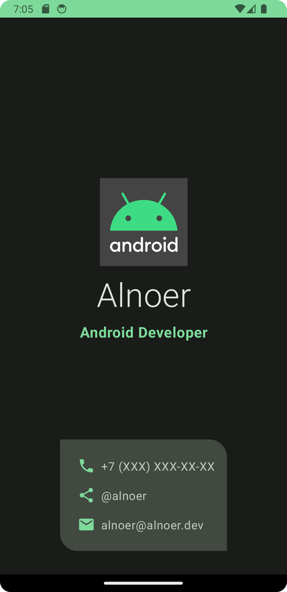

# Business Card

Simple business card app built with jetpack compose.

Android logo is taken from [this](https://github.com/google-developer-training/basic-android-compose-training-assets/tree/main) repository

## Screenshots

|  |  |
|------------------------------|-----------------------------|

## How to use
1. Clone repository
2. Change values in app/src/main/res/values/strings.xml by resource manager in Android Studio or with file editor
3. Compile and run